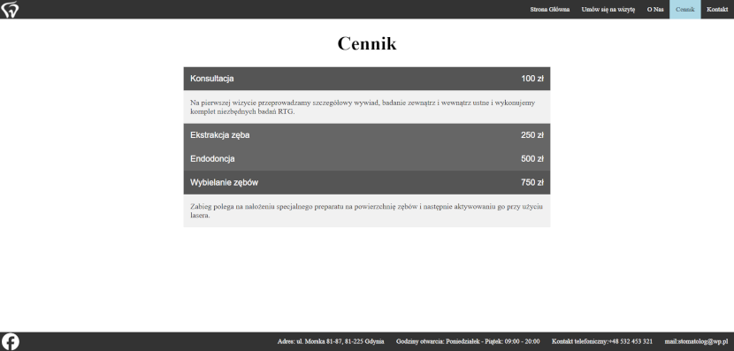
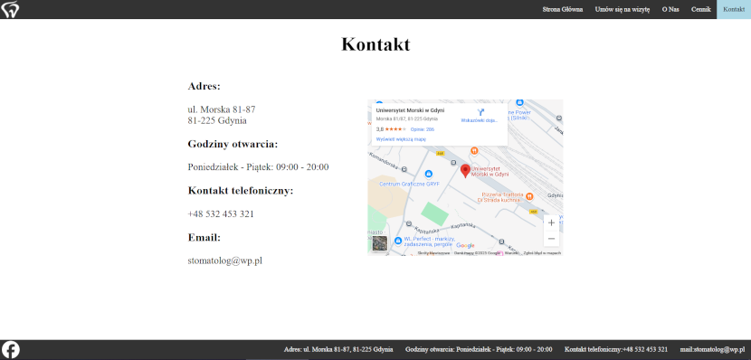

# 1. Informacje ogólne
* **Tytuł projektu:**
Strona internetowa gabinetu stomatologicznego
* **Link do Repozytorium:**
https://github.com/Tomaszek12345/Stomatolog
* **Autor:**
Tomasz Szydłowski
* **Krótki opis projektu:**
Prosty projekt strony internetowej dla gabinetu stomatologicznego zawierający podstrony: Strona Główna, Umów się na wizytę (Formularz), O Nas, Cennik, Kontakt.

# 2. Cel projektu
Głównym celem strony jest ułatwienie pacjentom znalezienia informacji o gabinecie, prezentację historji gabinetu i personelu, zapoznanie się z ofertą oraz umówienia się na wizytę online poprzez formularz.

# 3. Technologie:
* **HTML** - Struktura stron
* **CSS** - Stylizacja i układ stron
* **JS** - Slider wybielania zębów (Strona Główna), Min i Max daty (Formularz), Przyciski z opisami (Cennik)
* **PHP** - obsługa formularza
* **MySQL** - baza danych do przechowywania rezerwacji wizyt

# 4. Struktura strony
**Strona składa się z następujących podstron:**
* **Strona Główna** - Powitanie urzytkownika, Zdjęcia wizyt, Podstawowe informacje usług, Przycisk do umówienia wizyty i kontaktu, Slider o wybielaniu zębów.
* **Umów się na wizytę** - Formularz: Imię, Nazwisko, Adres email, Numer telefonu, Data wizyty, Rodzaj zabiegu (konsultacja, ekstrakcja zęba, endodoncja, wybielanie zębów), Dodatkowe uwagi.
* **O Nas** - Historia i nformacje o gabinecie i personelu.
* **Cennik** - Lista oferowanych usług wraz z ich cenami i krótkim opisem po kliknięciu.
* **Kontakt** - Adres placówki, Godziny otwarcia, Kontakt telefoniczny, Email, Mapa placówki.

# 5. Architektura plików
```
/Stomatolog
├── zdjecia/                            # Folder ze zdjęciami
├── index.html                          # Strona główna
├── index.css
├── form.html                           # Umów się na wizytę
├── form.css
├── o-nas.html                          # O nas
├── o-nas.css
├── cennik.html                         # Cennik
├── cennik.css
├── kontakt.html                        # Kontakt
├── kontakt.css
├── przeniesienie.php                   # Obsługa formularza
├── Baza_Danych_wersjaostateczba.sql    # Baza danych wizyt
└── README.md                           # Dokumentacja projektu
```

# 6. Zrzuty ekranu




